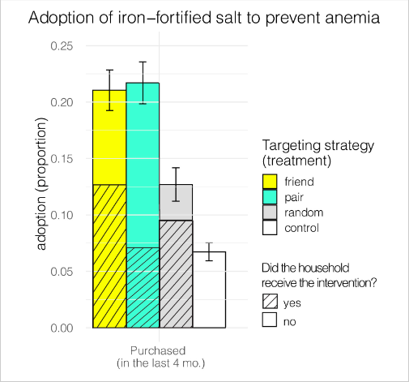
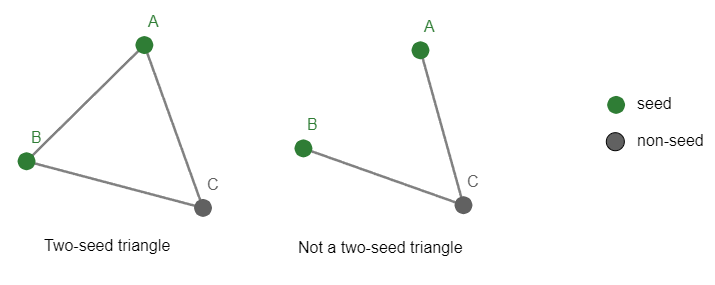
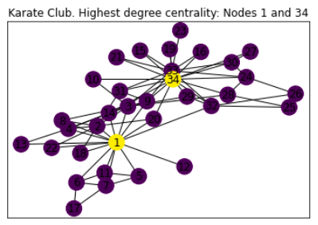
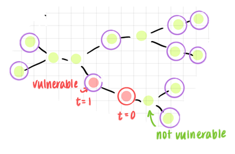
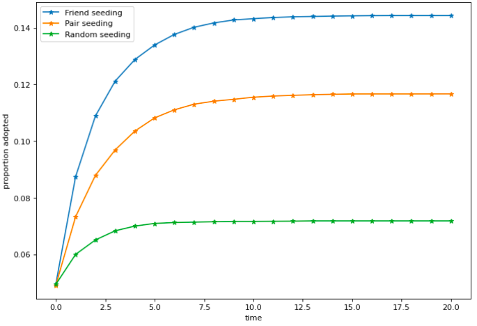

```{cat, engine.opts=list(file = "zoom.html")}
# <script src="https://lab.hakim.se/zoom-js/js/zoom.js" type="text/javascript"></script>
# <script type="text/javascript">
# 	slideshow.on( "beforeHideSlide", function( slide ) {
# 		zoom.out();
# 	} );
# 	slideshow.on( "afterShowSlide", function( slide ) {
# 		document.querySelector( ".remark-visible" ).addEventListener( "click", function( event ) {
# 			event.preventDefault();
# 			zoom.to( {element: event.target} );
# 		} );
# 	} );
# </script>
```

<!-- <style> -->
<!--   .superbigimage{ -->
<!--       overflow-x:scroll; -->
<!--       white-space: nowrap; -->
<!--   } -->

<!--   .superbigimage img{ -->
<!--      max-width: none; -->
<!--   } -->
<!-- </style> -->

```{r setup, include=FALSE}
options(htmltools.dir.version = FALSE)
knitr::opts_chunk$set(echo = FALSE, warning = FALSE, message = FALSE, 
                      fig.align = "center", out.width = "100%")


library(tidyverse)
library(plotly)
library(tidyverse)
library(plotly)
library(igraph)
library(tools) 
library(janitor)
library(htmlwidgets)
library(ggthemes)
library(visNetwork)
library(geomnet)
library(igraph)
library(visNetwork)
library(geomnet)
```


# Background

- Seeds: the initial nodes which receive an innovation
  - Choosing seeds with high centrality, shown to lead to greater diffusion

- Seeding methods: random, friend and pair
  - Utilise the Friendship paradox


```{r, out.width = "100%"}
knitr::include_graphics("slides_plots/seeding.PNG")
```

---

# Results from Alexander et al.'s (2022) seeding study

- Pair seeding has higher diffusion to non-targeted nodes (nodes that weren't seeds)
- Non-targeted node has highest probability of adopting an innovation if it's part of a two-seed triangle

.pull-left[
```{r, out.width = "100%"}

```
]

.pull-right[
```{r, out.width = "100%"}

```
]

---

# Research questions

.pull-left[

- How successful is each seeding method in reaching more central nodes? 

<br>

<br>

- Does the seeding method impact the number of two-seed triangles?

<br>

<br>

- Does the seeding method impact the spread of innovations in a simple threshold model?
]

<!-- stated earlier that seeds with higher centrality have been found  -->
.pull-right[

```{r, out.width = "50%"}

```


```{r, out.width = "100%"}

```


```{r, out.width = "50%"}

```
]

---
# Does each seeding method reach central nodes?
## Approach: correlation 

For a node, we simulated its probability of being selected as a seed:
  - Run several seeding iterations
  - Simulated probability  = proportion of times it got selected as seed

We then converted these probabilities to ranks. 

We also ranked nodes by their centrality measures 

$\rightarrow$ Pearson rank correlation 


---

# Correlation between seeding method and centrality 

```{r}
cor_mat = read_csv("correlations_dat.csv") %>% 
  select(contains("weaver"), `Targeting Method`, `Measure`) %>% 
  set_names(c("aves_weaver_social", "Targeting Method", "Measure")) %>% 
  pivot_wider(names_from = `Measure`, values_from = aves_weaver_social) %>% 
  column_to_rownames("Targeting Method")

cor_mat = rbind(cor_mat[3,], cor_mat[2,], cor_mat[1,])

cor_mat %>% 
  heatmaply::heatmaply(show_dendrogram = c(FALSE, FALSE), main = "Correlation heatmap on the Aves weaver network (N = 445)",key.title = "Spearman", cellnote = round(as.matrix(cor_mat), 2))#, Rowv = FALSE
```

---

# Two-seed triangles

- Alexander et al.found that untargeted nodes had the highest probability of adoption, when they were in a two-seed triangle

- Diffusion is not only about the neighbours initially targeted, the connection between neighbours (triangles) is also important

```{r, out.width = "80%"}
knitr::include_graphics("slides_plots/two-seed-triangleV2.png")
```

---

# Impact of seeding method on two-seed transitivity

<!-- <div class="superbigimage"> -->
<!-- </div> -->


<!-- <iframe src = "plotly_figures/twoSeedTransMainFigure.html" width = "400" height = "400" frameborder="0"></iframe -->

```{r}
g = readRDS("plotly_figures/twoSeedTransMainFigure.RDS")
#   + theme(axis.title.y = element_text(size = rel(0.8)))
ggplotly(g)

```

---


# When does pair have higher two-seed transitivity ?

```{r}
g = readRDS("plotly_figures/degreeVStriangles.RDS")
ggplotly(g)

```

---
# Networks types with higher pair two-seed transitivity

```{r}
dd <- read.table("mass_data/less_than_1500_nodes/aves-weaver-social/edges.edgelist")
graph <- graph.data.frame(dd, directed=FALSE)
nodes <- as.data.frame(unique(dd[, 1]))
colnames(nodes) <- c("id")
edges <- as.data.frame(dd)
colnames(edges) <- c("from", "to")
#Louvain Comunity Detection
cluster <- cluster_louvain(graph)
cluster_df <- data.frame(as.list(membership(cluster)))
cluster_df <- as.data.frame(t(cluster_df))
cluster_df$id <- str_replace(rownames(cluster_df), "X", "") %>% as.numeric()
#Create group column
nodes <- left_join(nodes, cluster_df, by = "id")
colnames(nodes)[2] <- "group"
network = visNetwork(nodes, edges) %>% 
  visPhysics(stabilization = FALSE, timestep = 0.75)


# visSave(network, file = "network.html")
network
```

---


# Impact of seeding method on spreading dynamics

## Proportion adopted vs time


```{r}
# 
g = readRDS("plotly_figures/spreading.RDS")
ggplotly(g)
```

---

# Impact of seeding method on spreading dynamics

## Proportion adopted afte 20 time-steps vs q

```{r}
g = readRDS("plotly_figures/qVSprop.RDS")
# g = g  +
#   theme(axis.title.y = element_text(size = rel(0.8), angle = 90))
ggplotly(g)

```

---

# Impact of seeding method on spreading dynamics

## Critical q vs N

```{r}
g = readRDS("plotly_figures/nVScascade.RDS")

# g = g  +
#   theme(axis.title.y = element_text(size = rel(0.8), angle = 90))
ggplotly(g)
```

---

# Conclusion

- Friend method correlated with centralities more than the pair method

- Pair seeding method can sometimes reach more two seed triangles and hence may be able to propagate diffusion

- Choice of seeding can impact the spreading of innovations

---


# Appendix


---
# Seeding method vs centrality across empirical networks

```{r}
big_res = read.csv("correlations_dat.csv")
big_res = big_res %>%
  rename_all(funs(stringr::str_replace_all(., 'N.', 'N='))) %>% 
  rename(`school.contacts.N=327` = `contacts.prox.high.school.2013.N=327`,
         `kor.mers.N = 186` = `kor.2015.mers.1.00.N=186`,
         `school.contacts2.N=327` = `contacts.prox.high.school.2013.attr.N=327`,
         `sgp.sars.N=172` = `sgp.2003.sars.1.00.N=172`,
          `usa.covid.N = 92`= `usa.2020.covid.6.00.N=92`,
         `tech.company.N=21`=`high_tech_company.N=21`,
         `usa.flu.N=286`=`usa.2009.flu.1.00.N=286`,
         `school.proximity.N=242` = `primary.school.proximity.N=242`)

big_res %>% 
  mutate(index = paste0(Targeting.Method, "_", Measure)) %>% 
  dplyr::select(-Targeting.Method, -Measure) %>% 
  column_to_rownames("index") %>% 
  data.frame() %>% 
  heatmaply::heatmaply(show_dendrogram = c(FALSE, FALSE), cols = FALSE)
```

---
